# 流式数仓踩坑实录

## 统一NOAH的系统时间

找到 了 https://blog.csdn.net/weixin_55751581/article/details/131419643，这里面说了 spider-flow 的时区问题。按照这个思路，我需要在运行容器的时候指定时区，参考 https://blog.51cto.com/u_16175479/7649742 和 https://zhuanlan.zhihu.com/p/658390008，加上了 -e TZ=Asia/Shanghai 参数，问题解决。

---

## flink 运行环境与sql-client 环境的统一

我把hdfs下面所有的 jar 包都补充到了 flink/lib，运行之后仍然存在报错，java.lang.ClassNotFoundException: org.apache.hadoop.thirdparty.protobuf.Message，还是需要找一下这个类在 Hadoop 的什么模块下面。在源码里面一搜，有好多地方都引用了 import 了 org.apache.hadoop.thirdparty.protobuf.Message。在maven中心仓库搜索了一下，搜到的是 https://central.sonatype.com/search?q=org.apache.hadoop.thirdparty.protobuf，也在代码里面找了一下 pom 文件的版本，发现是 1.1.1，好的，那就下载吧。然后拷贝到了 /usr/bigtop/3.2.0/usr/lib/flink/lib/tmp/hadoop-shaded-protobuf_3_7-1.1.1.jar。这把OK了，在 sql-client 里面也可以创建 paimon_catalog 了。但是又两个遗留问题：

1、是在 exit 的时候会报个错误

Exception in thread "Thread-5" java.lang.IllegalStateException: Trying to access closed classloader. Please check if you store classloaders directly or indirectly in static fields. If the stacktrace suggests that the leak occurs in a third party library and cannot be fixed immediately, you can disable this check with the configuration 'classloader.check-leaked-classloader'.
        at

org.apache.flink.runtime.execution.librarycache.FlinkUserCodeClassLoaders$SafetyNetWrapperClassLoader.ensureInner(FlinkUserCodeClassLoaders.java:164)

    at org.apache.flink.runtime.execution.librarycache.FlinkUserCodeClassLoaders$SafetyNetWrapperClassLoader.getResource(FlinkUserCodeClassLoaders.java:183)
        at org.apache.hadoop.conf.Configuration.getResource(Configuration.java:2830)
        at org.apache.hadoop.conf.Configuration.getStreamReader(Configuration.java:3104)
        at org.apache.hadoop.conf.Configuration.loadResource(Configuration.java:3063)
        at org.apache.hadoop.conf.Configuration.loadResources(Configuration.java:3036)
        at org.apache.hadoop.conf.Configuration.loadProps(Configuration.java:2914)
        at org.apache.hadoop.conf.Configuration.getProps(Configuration.java:2896)
        at org.apache.hadoop.conf.Configuration.get(Configuration.java:1246)
        at org.apache.hadoop.conf.Configuration.getTimeDuration(Configuration.java:1863)
        at org.apache.hadoop.conf.Configuration.getTimeDuration(Configuration.java:1840)
        at org.apache.hadoop.util.ShutdownHookManager.getShutdownTimeout(ShutdownHookManager.java:183)
        at org.apache.hadoop.util.ShutdownHookManager.shutdownExecutor(ShutdownHookManager.java:145)
        at org.apache.hadoop.util.ShutdownHookManager.access$300(ShutdownHookManager.java:65)
        at org.apache.hadoop.util.ShutdownHookManager$1.run(ShutdownHookManager.java:102)

在往上找到了 https://blog.csdn.net/h952520296/article/details/114327232，修改了相应的配置，但是重新启动 flink 之后，配置文件就被刷掉了。然后我尝试在 ambari 页面上修改 flink 的配置文件，重启 flink 的时候，底层文件居然同步发生变动了，卧槽，ambari 是有点高效啊，连配置文件都可以在页面上修改。

其实也不用又到maven搜索又找版本的，代码里面一搜，看看 POM 里面引入的是什么东西，然后在 /usr/bigtop/3.2.0/usr/lib/hadoop/lib 这个位置都有，直接拷贝就行了。

2、catalog 的创建好像只在 session 内生效，新的 session 里面仍然需要基于hdfs 目录声明 catalog，这个有点反直觉。暂时没找到确切的说法与持久化的选项，暂时先这样吧。

---

sql-client 执行 dml 的时候会报错

Flink SQL> select * from paimon_test_table;
[ERROR] Could not execute SQL statement. Reason:
java.lang.ClassNotFoundException: com.google.protobuf.ServiceException

搜索代码之后找到maven坐标是

    `<dependency>`

    `<groupId>`com.google.protobuf `</groupId>`

    `<artifactId>`protobuf-java `</artifactId>`

    `<scope>`compile `</scope>`

    `</dependency>`

将 /usr/bigtop/3.2.0/usr/lib/hadoop/lib/protobuf-java-2.5.0.jar 拷贝到 /usr/bigtop/3.2.0/usr/lib/flink/lib/tmp/protobuf-java-2.5.0.jar 之后，问题解决。

---

新的报错，执行 sql 的时候报错，Caused by: org.apache.flink.shaded.netty4.io.netty.channel.AbstractChannel$AnnotatedConnectException: Connection refused: localhost/127.0.0.1:8081

ambari 这边，flink 的后台管理页面端口是 8082 ，是不是因为这个的差异？往上找到这个 [flink 运维中遇到的问题_slot request bulk is not fulfillable! could not al_Mumunu-的博客-CSDN博客](https://blog.csdn.net/h952520296/article/details/114327232)，看起来确实是这个差异，把改成 rest.bind-port:8082 试一下，报错是不报了，但是查询也没反应，应该是端口不对。

最开始我搜索到 [Flink Connection拒绝：localhost / 127.0.0.1:8081_connect econnrefused 127.0.0.1:8081-CSDN博客](https://blog.csdn.net/u013749274/article/details/109097506) 这种帖子的时候，我是很鄙视的，你妹的，我怎么可能没启动 flink? 然后我试着先通过 start-cluster.sh 启动之后，在 sql-client 里面还真就能查询了。事实证明，我还真的就没启动 flink。

那么问题来了，streampark 运行的 flink 环境和 sql-client 运行的 flink 环境是两个独立的环境么？？？？

通过 [SQL 客户端 | Apache Flink](https://nightlies.apache.org/flink/flink-docs-release-1.15/zh/docs/dev/table/sqlclient/) 和 [FlinkSQL Client提交到Yarn flink提交任务到yarn_mob6454cc6bf0b7的技术博客_51CTO博客](https://blog.51cto.com/u_16099239/7509283) 结合来看，flink 1.15 里面的 sql-client 好像确实是只能支持 standalone 模式。而 streampark 使用的是 yarn application 的模式，所以，二者确实不是一套环境。

## 流式数仓的实践参考

我准备每天看一些 Paimon 公众号的文章，把里面实用的部分（最好是代码级别的）收集起来，这样我就知道一些 Paimon 在使用上的基本招式，知道了哪些能做、哪些做不了，就可以把他们组合起来了。

| 文章推送日期 | 链接                                                                                                                                                                                                                                                                                                            | 重点摘要                                                                                                                                                                                                                |
| ------------ | --------------------------------------------------------------------------------------------------------------------------------------------------------------------------------------------------------------------------------------------------------------------------------------------------------------- | ----------------------------------------------------------------------------------------------------------------------------------------------------------------------------------------------------------------------- |
| 2023-03-29   | [Apache Paimon 在同程旅行的探索实践 (qq.com)](https://mp.weixin.qq.com/s/edS2_TKhg3jRC0MXzhiCpg)                                                                                                                                                                                                                   | Paimon同主键局部列更新case                                                                                                                                                                                              |
| 2023-04-14   | [巴别时代基于 Apache Paimon 的 Streaming Lakehouse 的探索与实践 (qq.com)](https://mp.weixin.qq.com/s/NxYvXj5NHRJf1J8oFiFmfQ)                                                                                                                                                                                       | 介绍了Paimon支持的 Merge Engine 类型，用于相同主键的数据合并 介绍了Paimon支持的 Changelog Producer，用于生成自己的CDC 事实表关联维表的case Paimon同主键局部列更新case Retry Lookup Join 的关联语法 |
| 2023-05-23   | [深入理解 Apache Paimon 湖存储文件操作 (qq.com)](https://mp.weixin.qq.com/s?__biz=MzkyNjQ1MDI3Mg==&mid=2247483806&idx=1&sn=b8660402bb3901d69385670dbb14dad0&chksm=c366110b48f674cca7f86eb6d6ada46ddec41a225f71bf297a6eb5c949978271b03b233248e0&scene=126&sessionid=1703679365#rd)                                  | Paimon 文件管理原理（到具体的文件路径）                                                                                                                                                                                 |
| 2023-06-21   | [海程邦达基于Apache Paimon+Streampark实现 Streaming warehouse的实战应用 (qq.com)](https://mp.weixin.qq.com/s?__biz=MzkyNjQ1MDI3Mg==&mid=2247483906&idx=1&sn=499a621fbbf3cdcd2574cb9a51d55706&chksm=c33347a2e16b58cf3066dc8071b6975c951c04c960415fa03cf2dab5298b4aafa09c6d699652&scene=126&sessionid=1703679365#rd) | 通过聚合引擎，指定字段的聚合方式fields.sum_orderCount.aggregate-function，来实现订单的计数                                                                                                                              |
| 2023-08-30   | [Apache Paimon 实时数据湖 Streaming Lakehouse 的存储底座 - 知乎 (zhihu.com)](https://zhuanlan.zhihu.com/p/651522794?utm_id=0)公众里面有相同的文章，但是标题带竖线，命中了markdown的关键字                                                                                                                          |                                                                                                                                                                                                                         |
| 2023-10-12   | [基于 Apache Paimon 的 Append 表处理 (qq.com)](https://mp.weixin.qq.com/s?__biz=MzkyNjQ1MDI3Mg==&mid=2247484078&idx=1&sn=b553af3a1564066460f5197ce6c2c63d&chksm=c3c0642efb0bf9a92814bb8869547de1d2b9804778618cf625c0209997453982d0fff0135fd7&scene=126&sessionid=1703774955#rd)                                    | 虽然是append，但是有一些实战的成分                                                                                                                                                                                      |
| 2023-11-13   | [Apache Flink 和 Paimon 在自如数据集成场景中的使用 (qq.com)](https://mp.weixin.qq.com/s/fxWsEcvSSDfsUzCScKRCMw)                                                                                                                                                                                                    | 提供了外键打宽的思路                                                                                                                                                                                                    |
| 2023-11-22   | [Flink + Paimon 数据 CDC 入湖最佳实践 (qq.com)](https://mp.weixin.qq.com/s/pSc-VUYYFdrvrgl0BmHYQg)                                                                                                                                                                                                                 | 将paimon用作存储载体，着眼于hive的平滑迁移                                                                                                                                                                              |
| 2023-11-29   | [Apache Doris 整合 FLINK CDC 、Paimon 构建实时湖仓一体的联邦查询入门 (qq.com)](https://mp.weixin.qq.com/s?__biz=MzkyNjQ1MDI3Mg==&mid=2247484196&idx=1&sn=d4391f1c60ce88de3b619babd8a50d63&chksm=c3f92d9bea08574800384a3db07b2085bac19b5000ca9c049042b118319026f146f4c239ed33&scene=126&sessionid=1703774949#rd)    | doris有能力直接读取Paimon表的数据了                                                                                                                                                                                     |
| 2023-12-14   | [Paimon 在汽车之家的业务实践 (qq.com)](https://mp.weixin.qq.com/s?__biz=MzkyNjQ1MDI3Mg==&mid=2247484223&idx=1&sn=4b74ff41b4982a198562f80a94770d7e&chksm=c348de68be8fa1881359db327cee0f892edc67e12a8bd9c8675227a2f07bbd13fc01ef3d4944&scene=126&sessionid=1703774949#rd)                                            | 动态更新，使用到了局部列更新和upsert功能                                                                                                                                                                                |
| 2023-12-25   | [Apache Paimon 在蚂蚁的生产实践 (qq.com)](https://mp.weixin.qq.com/s?__biz=MzkyNjQ1MDI3Mg==&mid=2247484232&idx=1&sn=d6505dd9759c399669ad8fb6f147e2ee&chksm=c31d1e574832a9c3565eaf63af3cee49fa9bbb961100527032be3bfad11c631523ad356a7870&scene=126&sessionid=1703774949#rd)                                         | 给出了一个外键关联的思路                                                                                                                                                                                                |
|              |                                                                                                                                                                                                                                                                                                                 |                                                                                                                                                                                                                         |
|              |                                                                                                                                                                                                                                                                                                                 |                                                                                                                                                                                                                         |
|              |                                                                                                                                                                                                                                                                                                                 |                                                                                                                                                                                                                         |
|              |                                                                                                                                                                                                                                                                                                                 |                                                                                                                                                                                                                         |
|              |                                                                                                                                                                                                                                                                                                                 |                                                                                                                                                                                                                         |
|              |                                                                                                                                                                                                                                                                                                                 |                                                                                                                                                                                                                         |
|              |                                                                                                                                                                                                                                                                                                                 |                                                                                                                                                                                                                         |
|              |                                                                                                                                                                                                                                                                                                                 |                                                                                                                                                                                                                         |

其他地方收集到的资料

| col1                                                                                                                                                                                                          | col2                                                                                                                                                                                                                                                                                                                                                                                                                                                                                                                                                                                                                                                                                                                                                                                                                                                                                                                                                                                                                                                                                                                                                                                                                                                                                                                                                                                                                                                                                                                                                                                                                                                                                                                                                                                                                                                                                                                                  |
| ------------------------------------------------------------------------------------------------------------------------------------------------------------------------------------------------------------- | ------------------------------------------------------------------------------------------------------------------------------------------------------------------------------------------------------------------------------------------------------------------------------------------------------------------------------------------------------------------------------------------------------------------------------------------------------------------------------------------------------------------------------------------------------------------------------------------------------------------------------------------------------------------------------------------------------------------------------------------------------------------------------------------------------------------------------------------------------------------------------------------------------------------------------------------------------------------------------------------------------------------------------------------------------------------------------------------------------------------------------------------------------------------------------------------------------------------------------------------------------------------------------------------------------------------------------------------------------------------------------------------------------------------------------------------------------------------------------------------------------------------------------------------------------------------------------------------------------------------------------------------------------------------------------------------------------------------------------------------------------------------------------------------------------------------------------------------------------------------------------------------------------------------------------------- |
| [基于Flink+Paimon搭建流式湖仓_实时计算 Flink版(Flink)-阿里云帮助中心 (aliyun.com)](https://help.aliyun.com/zh/flink/use-cases/untitled-document-1699862767755?spm=a2c4g.11186623.0.0.727c4224BGo766)             | 阿里云给出的实践案例                                                                                                                                                                                                                                                                                                                                                                                                                                                                                                                                                                                                                                                                                                                                                                                                                                                                                                                                                                                                                                                                                                                                                                                                                                                                                                                                                                                                                                                                                                                                                                                                                                                                                                                                                                                                                                                                                                                  |
| [2023云栖大会-聚合话题：开源大数据 (aliyun.com)](https://yunqi.aliyun.com/2023/subforum/YQ-Club-0044)                                                                                                            | 有一段在阿里云上使用Paimon的演示                                                                                                                                                                                                                                                                                                                                                                                                                                                                                                                                                                                                                                                                                                                                                                                                                                                                                                                                                                                                                                                                                                                                                                                                                                                                                                                                                                                                                                                                                                                                                                                                                                                                                                                                                                                                                                                                                                      |
| [福利「Flink Forward Asia 2023 」视频合集！-阿里云开发者社区 (aliyun.com)](https://developer.aliyun.com/article/1404268?spm=ffa.ffa-home.0.0.3b4d73f4npIJ1O&accounttraceid=3046e5bd05d64ea584d5c1d98139f6bdmcnk) | FFA2023视频目录                                                                                                                                                                                                                                                                                                                                                                                                                                                                                                                                                                                                                                                                                                                                                                                                                                                                                                                                                                                                                                                                                                                                                                                                                                                                                                                                                                                                                                                                                                                                                                                                                                                                                                                                                                                                                                                                                                                       |
| [Flink Forward Asia 2023 (xiaoeknow.com)](https://apppejqdt9q1797.h5.xiaoeknow.com/p/course/ecourse/course_2ZTFDp7b0NmtssQtobnZkCbM0rv)                                                                          | FFA2023视频 + PPT，但是都不能下载，遗憾                                                                                                                                                                                                                                                                                                                                                                                                                                                                                                                                                                                                                                                                                                                                                                                                                                                                                                                                                                                                                                                                                                                                                                                                                                                                                                                                                                                                                                                                                                                                                                                                                                                                                                                                                                                                                                                                                               |
| [flink forward asia 2023主论坛-云视频-阿里云开发者社区 (aliyun.com)](https://developer.aliyun.com/live/252869?spm=a2c6h.12873639.article-detail.8.784f7c12vGsFh1#comment)                                        | flink + paimon + doris 铁三角 flinkCDC 的全增量一体化是一个核心卖点                                                                                                                                                                                                                                                                                                                                                                                                                                                                                                                                                                                                                                                                                                                                                                                                                                                                                                                                                                                                                                                                                                                                                                                                                                                                                                                                                                                                                                                                                                                                                                                                                                                                                                                                                                                                                                                              |
| [流式湖仓专场（一）-云视频-阿里云开发者社区 (aliyun.com)](https://developer.aliyun.com/live/253628?spm=a2c6h.12873639.article-detail.9.784f7c12vGsFh1)                                                           | 创始人给出的主要场景：CDC更新入湖、同主键打宽局部列更新、append表流读流写(支持z-order排序提高点查效率) paimon0.6 提供hive表的“原地升级"，这个可能有用 starRock针对Paimon进行了优化（doris暂时还在推进） 【联通】 从实时订阅服务演进，用paimon平替kafka，没有用到太多特性，数年吹了一波 streampark 介绍了paimon使用过程中的几个tips: partautal-update(端到端延迟较高) -> deduplicate(关掉changelog-nornalize算子) dedicated-compaction，配合参数 snapshot.expire.execution-mode=async，降低对HDFS的性能要求 使用consumer-id，媲美kafka的连续性流读 更多细节调参如下： 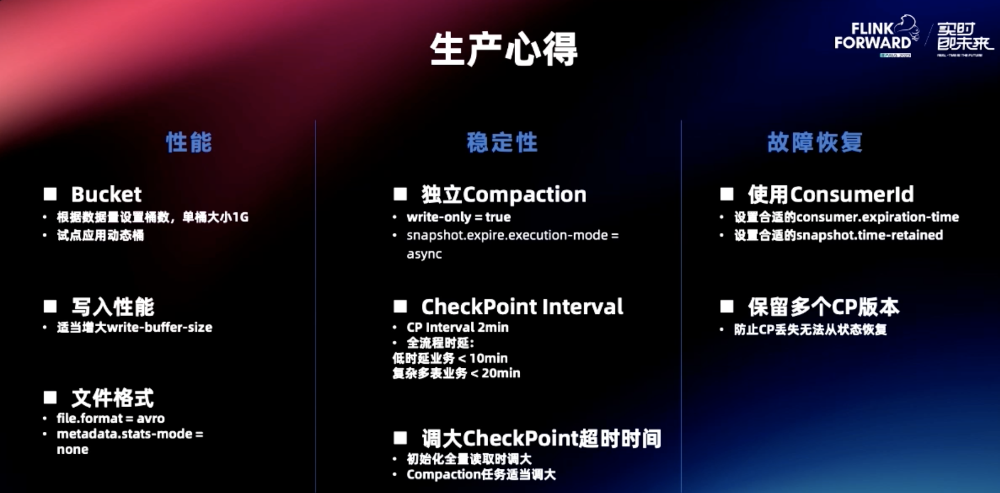 【同程旅行】 Spark+Kudu -> Flink+Hudi -> Flink+Paimon，着眼于资源节省和查询提效 提到数据重跑的幂等性对于流式湖仓是一个挑战，提问环节也问到，回复是"和社区同步，社区正在建设"。。。 也提到了同步删除模式影响commit性能，改用异步删除快照 snapshot.expire.execution-mode=async 动态分桶 ods-主键模型，dwd-部分列更新，dws-聚合模型 爆出的已知问题与解决 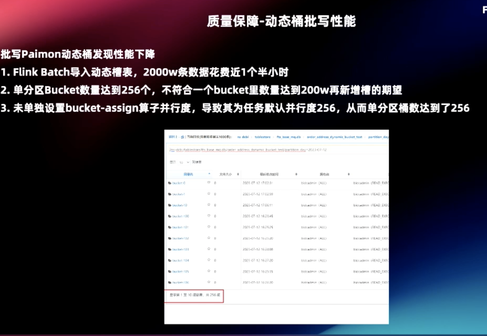 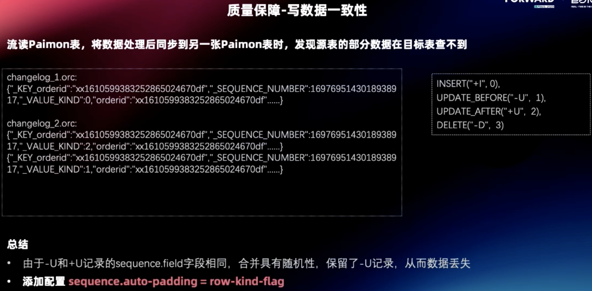 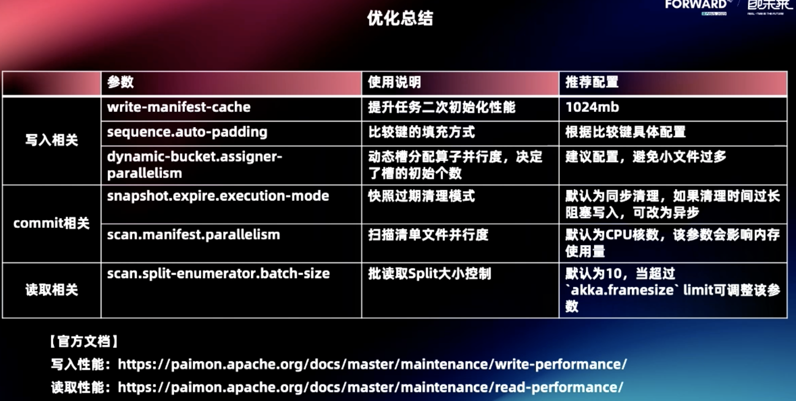 【汽车之家】 从传统的 lambda 架构升级而来 实例1 局部列更新，拼宽表；starrocks创建物化视图，starrock3.2 会发布 实例2 使用append表传输流量数据，通过命令行调用 paimon-flink-action.jar，对paimon表进行排序合并，提高查询效率 实例3 使用upsert功能，其实我每太理解这里要解决什么问题，感觉就是个union呀 优化实践，讲到了flink写入paimon过程中的几个角色， 讲了一些底层问题与解决，最终提到是已经合并到了 Paimon 0.5 版本 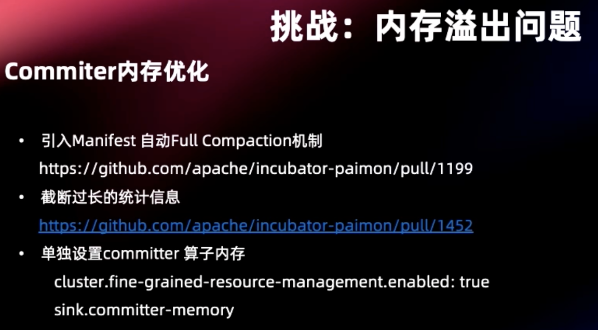 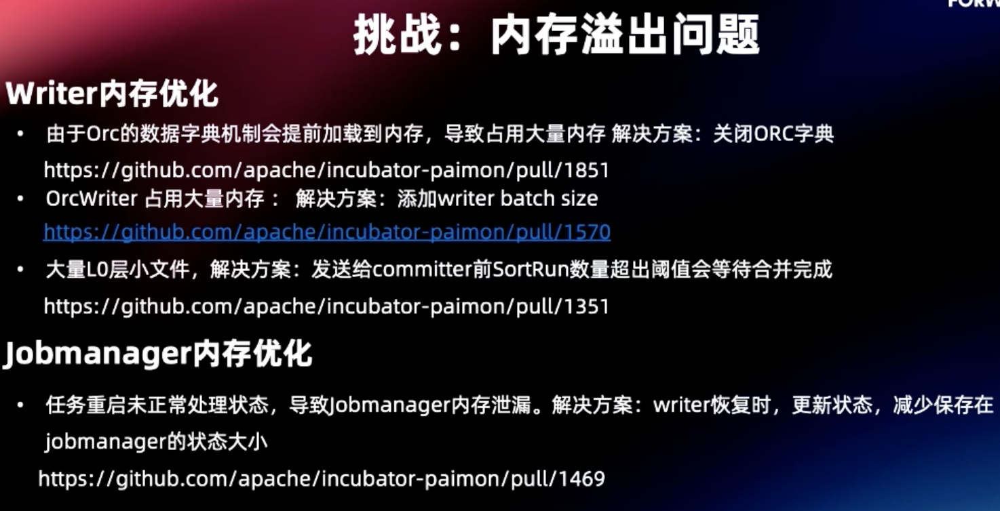 【OPPO】 主要是在分布式内存中处理异构/非结构化数据，用于AI场景。 |
| [核心技术专场(一)-云视频-阿里云开发者社区 (aliyun.com)](https://developer.aliyun.com/live/253625?spm=a2c6h.12873639.article-detail.10.784f7c12vGsFh1)                                                            | 流式存储专场 盘点了kafka在实时计算领域的局限，引出 fluss。流读流写，点查很快，适用于实时场景的管道与维表关联                                                                                                                                                                                                                                                                                                                                                                                                                                                                                                                                                                                                                                                                                                                                                                                                                                                                                                                                                                                                                                                                                                                                                                                                                                                                                                                                                                                                                                                                                                                                                                                                                                                                                                                                                                                                                     |
| [平台建设专场-云视频-阿里云开发者社区 (aliyun.com)](https://developer.aliyun.com/live/253629?spm=a2c6h.12873639.article-detail.12.3ab17c125WvUsM)                                                                | 平台建设中也介绍了应用paimon来构建流批一体存储基础 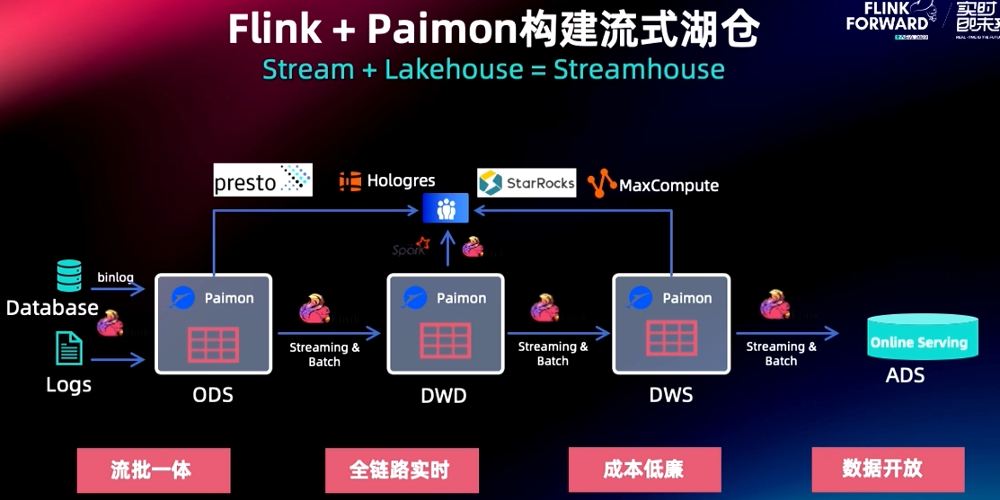 瓴羊也来刷存在感了，还介绍了一下Dataphin，但是着重在讲的是现在的实时能力了【】                                                                                                                                                                                                                                                                                                                                                                                                                                                                                                                                                                                                                                                                                                                                                                                                                                                                                                                                                                                                                                                                                                                                                                                                                                                                                                                                                                                                                                                                                                                                                                                                                                                                                                                                  |
| [流批一体专场-云视频-阿里云开发者社区 (aliyun.com)](https://developer.aliyun.com/live/253626?spm=a2c6h.12873639.article-detail.13.3ab17c125WvUsM)                                                                | 流批一体，只能在面向运维的角度来表达(统一API、统一算子、统一引擎) 提出了一个新概念叫流批融合，其思路是：流有流的好，批(微批)有批的好，那么能不能搞一个机制让flink动态的切换流模式和批模式 【小红书】 提到了近实时数仓，出发点是解决夜间调度的时效性 这个老哥对数仓场景的理解还可以，不是纯技术视角。 先说了全量表。 他用他的成本理论分析了dwd全量表的成本，结论是理论上实时加工相对离线加工有优势， 主要问题是实操过程中state的ttl置为永久，资源的消耗是非常夸张的。 进而提到应用数据湖的局部更新是一种解决思路，也指出了当前数据湖局部更新的局限： 外键关联支持的不好，可以借助临时表的方式曲线救国，但落地方式会变得复杂 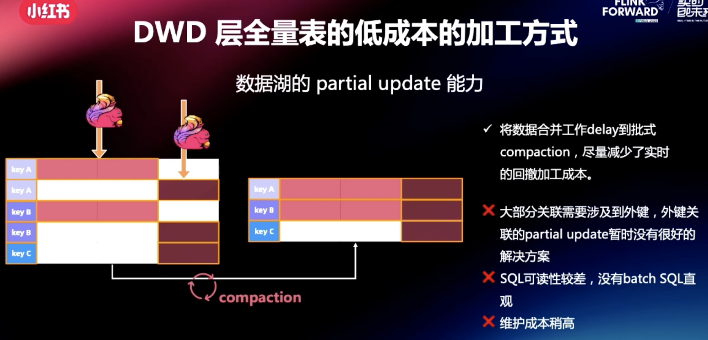 然后说了增量表。 对于增量表的场景讲了一些flink流式计算上的一些不足，主要的解决思路是改用微批 【字节】 主要讲的是从spark迁移到flink的工作 【小米】 讲的是流批一体数仓，纯离线 -> lambda(spark批flink流) -> 预期是计算框架统一+存储介质统一 技术选型是 flink + iceberg，给出了iceberg表的选型和数仓分层的适配情况 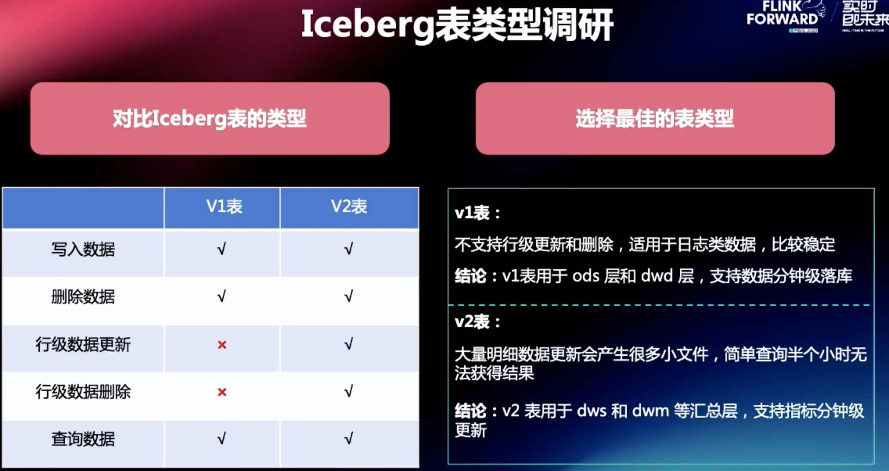 湖格式存储增加了存储压力，给出了一些调优实践 【字节】 通过逻辑表合并流数据和存量数据，需要基于开源组件进行深度开发。 利用湖存储的 changlog 能力，进行数据的动态更新 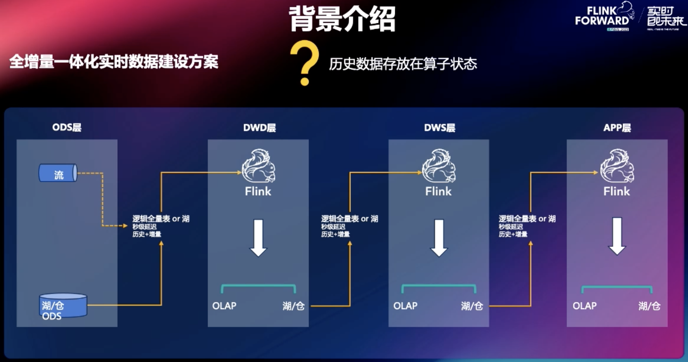 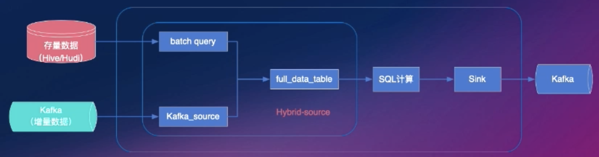 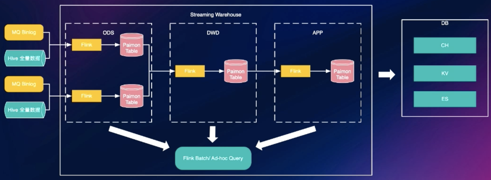                                                                                                                                                                                                                                                                                                                                                                                             |
| [行业实践专场(一)-云视频-阿里云开发者社区 (aliyun.com)](https://developer.aliyun.com/live/253633?spm=a2c6h.12873639.article-detail.14.784f7c12vGsFh1)                                                            | 【中原银行】(参考即可，演讲人存在多个概念错误和表述错误) flink+kafka -> flink灌OLAP引擎 -> 湖仓 表述上有些问题，管实时快照叫维度表，其实就是周期快照事实表的场景(金融行业的余额类场景) 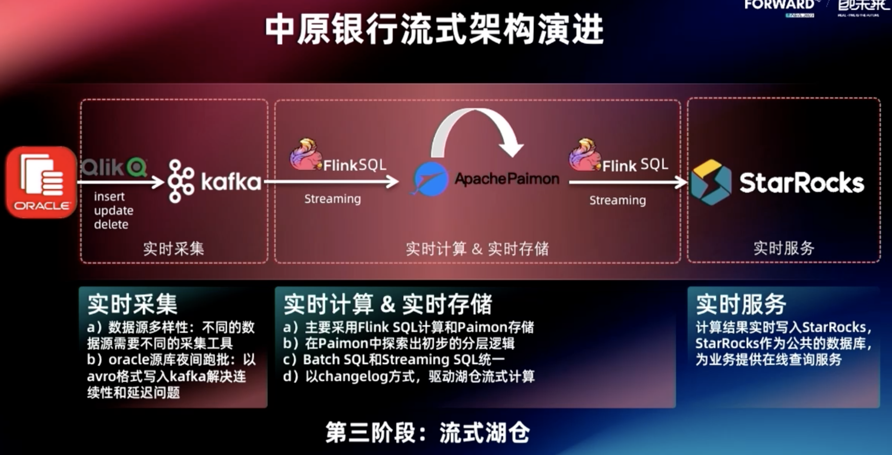 他这个分层我个人觉得不科学，没有dwd，直接干到 dws 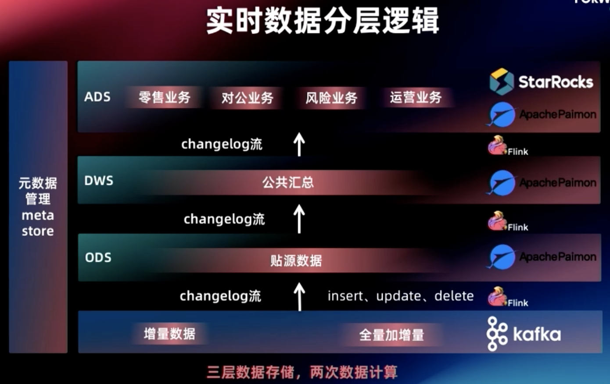 周期快照实时表，在湖仓场景的实现案例（演讲老哥对维度表的概念有误解） 为了增强准确性，除了cdc之外，还会天级跑批进行数据更新 join的过程还是使用flink，那上湖到底是上了个什么？ 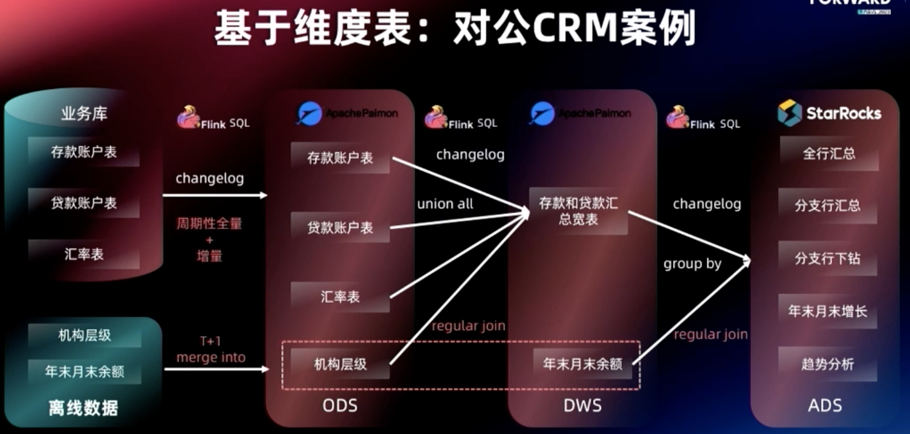 【美的】 演讲核心是他们搞的风控系统，讲的很范，没有数仓的相关参考 【上汽乘用车】 讲的是flink在上汽的落地实践，也比较范，干货不多 【中南电力】 光伏及风机的实时监控与预警，偏应用 【跨越速运】 OceanBase存储 + flink引擎 的行业应用，非金融领域使用OceanBase还是比较冷门的，没啥通用参考性。                                                                                                                                                                                                                                                                                                                                                                                                                                                                                                                                                                                                                                                                                                                                                                                                                                                                                                                                                     |
| [生产实践专场（一）-云视频-阿里云开发者社区 (aliyun.com)](https://developer.aliyun.com/live/253644?spm=a2c6h.12873639.article-detail.15.784f7c12vGsFh1)                                                          | flink稳定性与调优专场                                                                                                                                                                                                                                                                                                                                                                                                                                                                                                                                                                                                                                                                                                                                                                                                                                                                                                                                                                                                                                                                                                                                                                                                                                                                                                                                                                                                                                                                                                                                                                                                                                                                                                                                                                                                                                                                                                                 |
| [核心技术专场（二）-云视频-阿里云开发者社区 (aliyun.com)](https://developer.aliyun.com/live/253636?spm=a2c6h.12873639.article-detail.16.784f7c12vGsFh1)                                                          | flink SQL 2023年度 review flink batch 的新进展 Flink Connector 的进展                                                                                                                                                                                                                                                                                                                                                                                                                                                                                                                                                                                                                                                                                                                                                                                                                                                                                                                                                                                                                                                                                                                                                                                                                                                                                                                                                                                                                                                                                                                                                                                                                                                                                                                                                                                                                                                       |
| [数据集成专场-云视频-阿里云开发者社区 (aliyun.com)](https://developer.aliyun.com/live/253643?spm=a2c6h.12873639.article-detail.17.784f7c12vGsFh1)                                                                | flink CDC 3.0 只有source -> 端到端/api易用性 上游表结构频繁变更 -> 自动演进 (核心卖点) 扩展性不足 -> 空闲资源回收 开源协议 -> 捐赠apache (暂时还没有完成捐赠，目前flink-cdc3.0还是挂在[ververica](https://github.com/ververica)下面) 从演讲案例来看，主推的同步方式是通过yaml文件输入参数 【飞轮科技】 讲的是 flink doris connector ，这玩意不是开源就有的么？重复造轮子了？ 基于 flinkCDC 2.x 实现了表结构的动态同步。 使用 streampark 调用 jar 包，配合参数输入进行整库同步。 【阿里云dataworks】 主要讲的是产品的集成与应用、案例分享 【bilibili】 flink CDC + Hudi 的数据同步应用 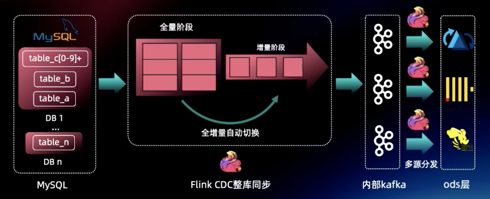                                                                                                                                                                                                                                                                                                                                                                                                                                                                                                                                                                                                                                                                                                                                                                                                                                                                                                                                                                                                                                                                                                                                                                                                                     |
| [流式湖仓专场（二）-云视频-阿里云开发者社区 (aliyun.com)](https://developer.aliyun.com/live/253637?spm=a2c6h.12873639.article-detail.18.784f7c12HVh0eK)                                                          | 【阿里云】 先讲了离线数仓和实时数仓面临的问题。 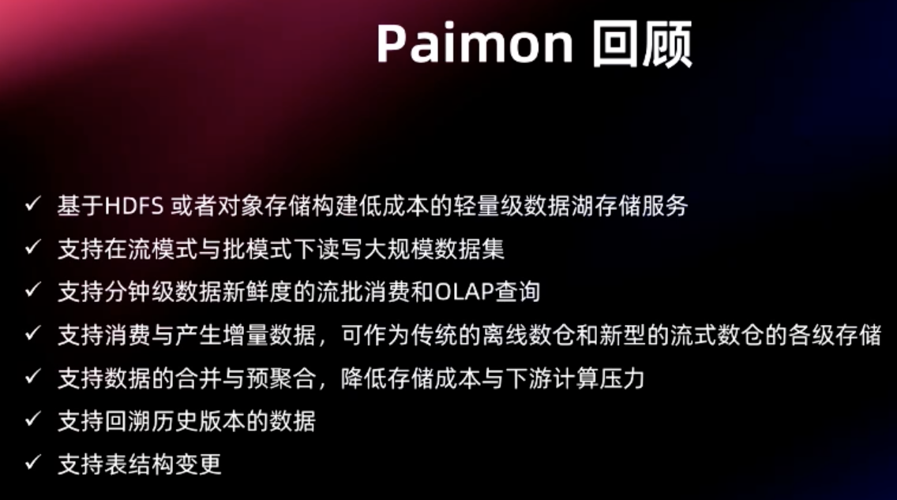 从离线角度出发，看如何改造成流式湖仓。 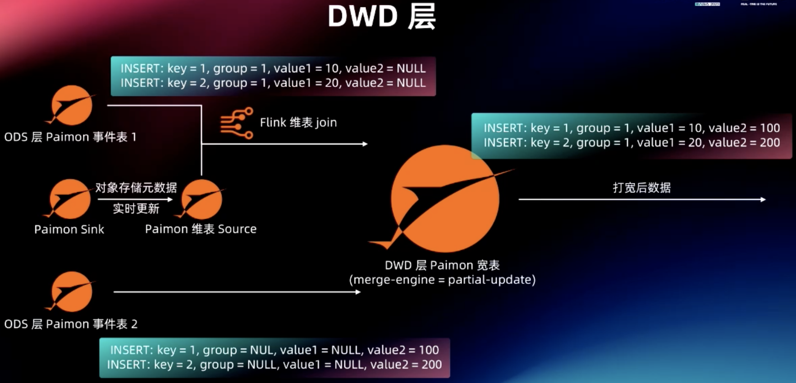 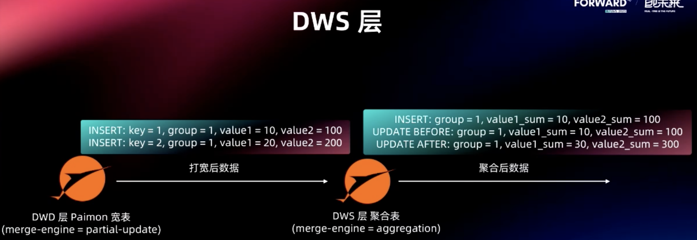 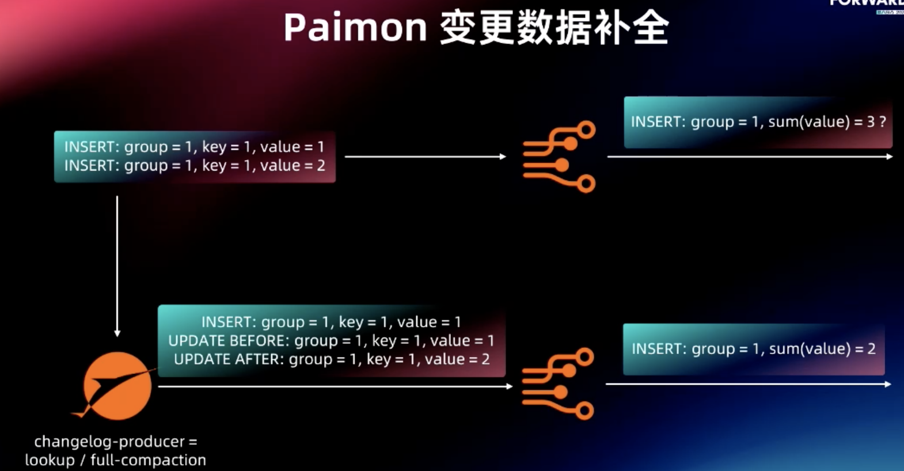 是用 flink的聚合？还是用 paimon 的聚合表？ 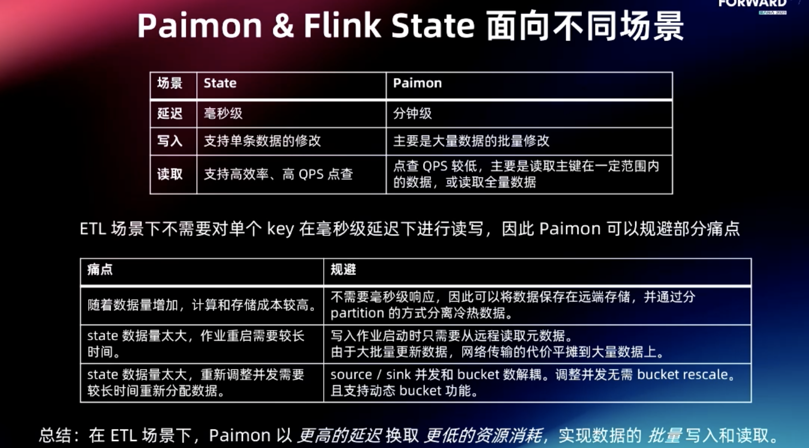 最终，话题收到流式湖仓架构 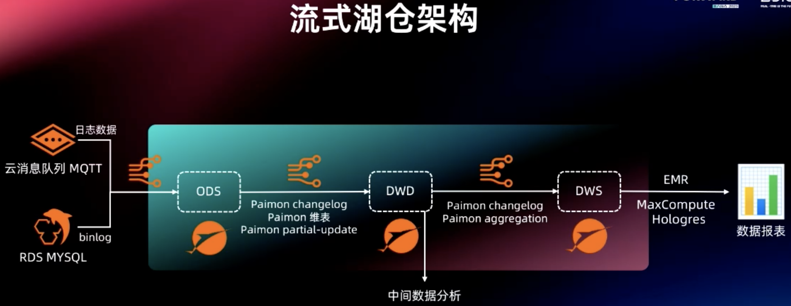 案例案例 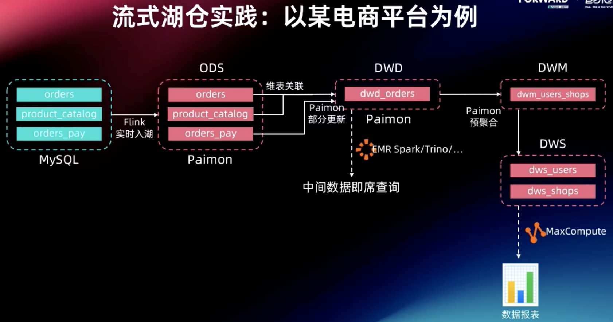 ODS层 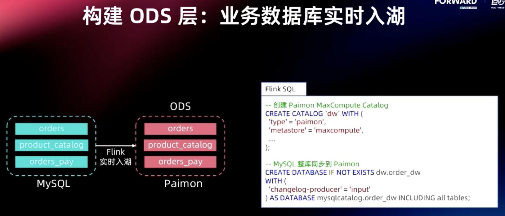 DWD层宽表 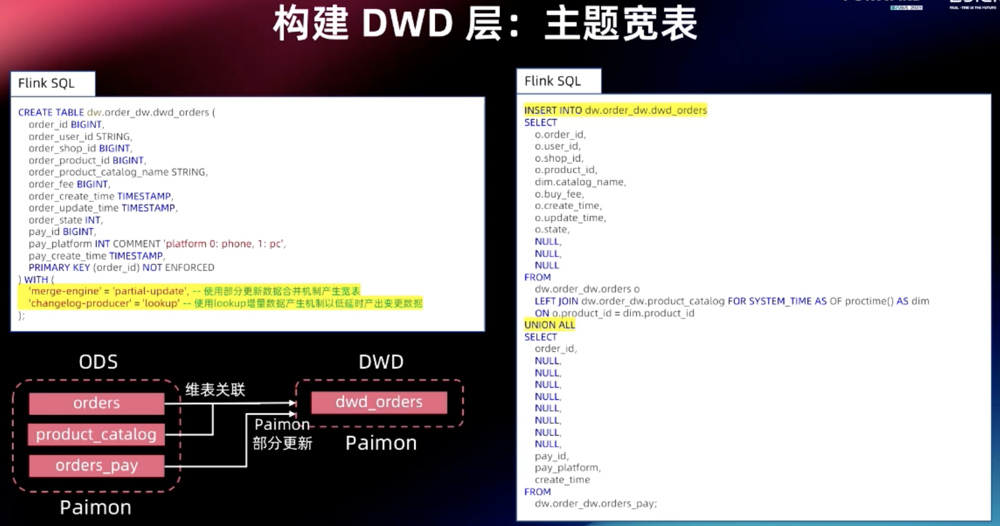 DWS聚合操作 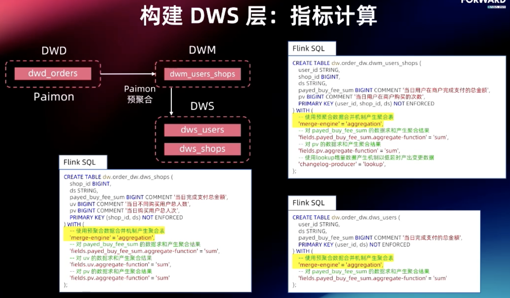 这里想说，去重计数的操作，可以通过多级变粒度的统计来实现 并且可以通过参数来优化热点数据造成的倾斜 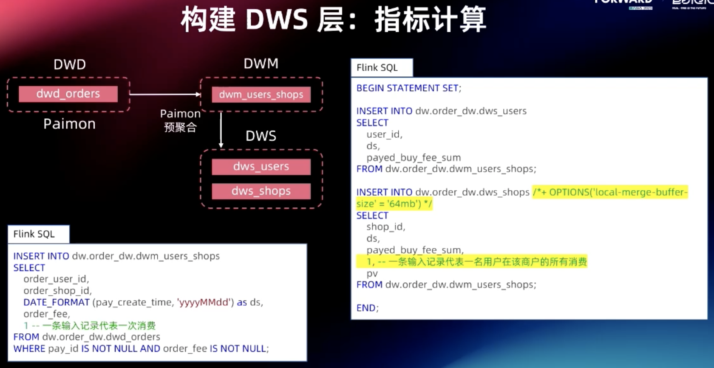 元数据直接可查 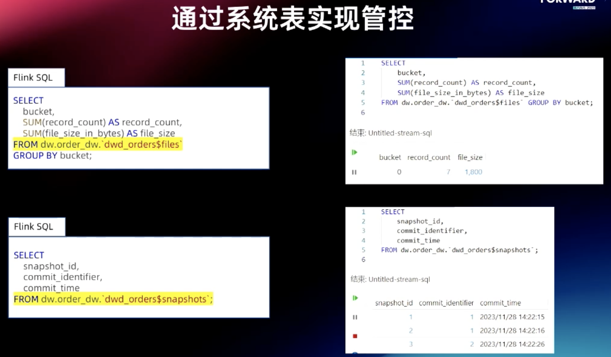 【网易】 Flink + Paimon + Amoro Amoro 是网易开源的数据湖管理平台，大概的功能是下面这些  讲了一下网易数仓在 lambda 时期的架构 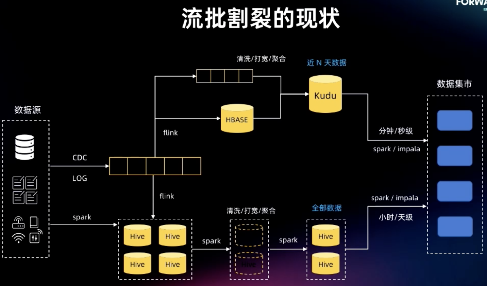 这里讲到了业界早期对数据湖的定位认知 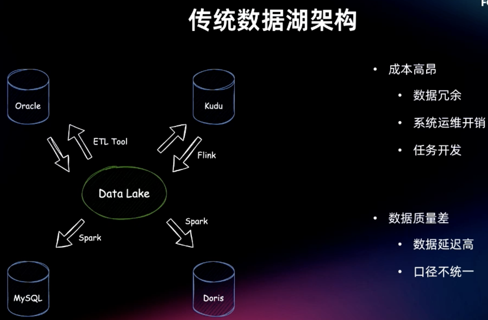 提出内容推荐场景对实时数据最感兴趣。 【阿里云】Flink + Paimon + Hologres(OLAP引擎) 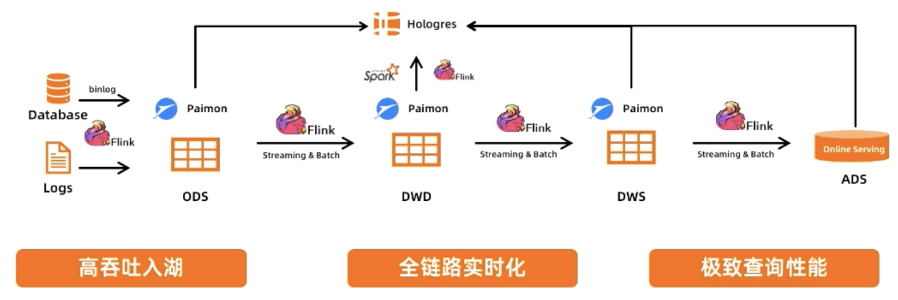 后面都是介绍 Hologres 居多了，不是我想听的主题了。 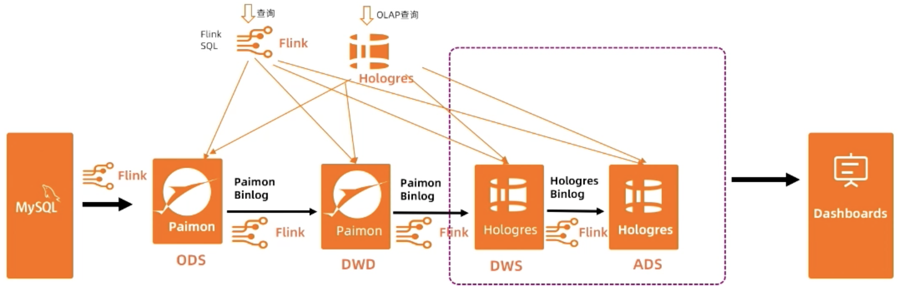 这倒是提供了一个思路，叶子节点层，可以适当放到olap。                                                      |
|                                                                                                                                                                                                               |                                                                                                                                                                                                                                                                                                                                                                                                                                                                                                                                                                                                                                                                                                                                                                                                                                                                                                                                                                                                                                                                                                                                                                                                                                                                                                                                                                                                                                                                                                                                                                                                                                                                                                                                                                                                                                                                                                                                       |

---

---
